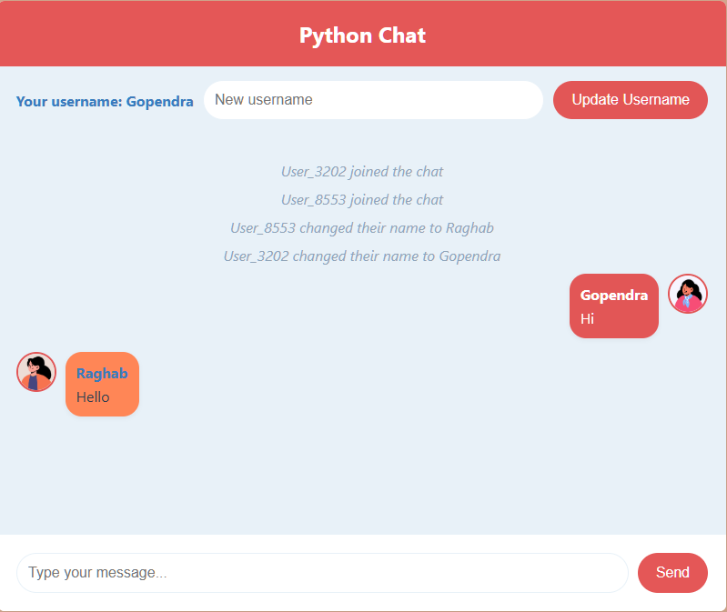

# Flask Real-Time Chat App

This is a real-time chat application built with Flask and Flask-SocketIO. It allows users to connect, send messages, and update their usernames dynamically. User avatars are randomly assigned based on a simple avatar API.

## Features

- Real-time communication using WebSockets.
- Randomly assigned usernames and avatars for new users.
- Dynamic username updates.
- Broadcast messages and events for user join, leave, and message notifications.

## Screenshots

### Home Page


*The landing page where users connect to the chat.*

---

## Getting Started

Follow these instructions to set up and run the project locally.

### Prerequisites

- Python 3.8 or higher
- pip (Python package manager)

### Installation

1. Clone the repository:

   ```bash
   git clone https://github.com/Gopendranath/Python-ChatApp.git
   cd your-repository
   ```

2. Install dependencies:

   ```bash
   pip install -r requirements.txt
   ```

3. Run the application:

   ```bash
   python app.py
   ```

4. Run in web service: to host

   ```bash
   gunicorn --worker-class eventlet -w 1 wsgi:app
   ```

5. Open your browser and navigate to:

   ```
   http://127.0.0.1:5000
   ```

   Live Demo [https://python-chatapp-okhs.onrender.com/](https://python-chatapp-okhs.onrender.com/)

### File Structure

- `app.py`: Main application logic for handling user connections, messages, and events.
- `requirements.txt`: Lists all Python dependencies.
- `wsgi.py`: WSGI entry point for deploying the app in production.

## Dependencies

The application uses the following Python libraries:

- **Flask**: Web framework
- **Flask-SocketIO**: WebSocket support
- **Gunicorn**: WSGI server for production
- Other required libraries are listed in `requirements.txt`.

## Deployment

For production, use a WSGI server like Gunicorn:

```bash
gunicorn --worker-class eventlet -w 1 wsgi:app
```


Feel free to modify this `README.md` to better suit your project’s specific details or any additional features. Let me know if you need further customization!
